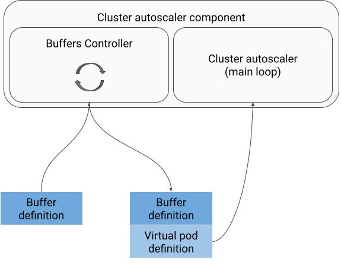

# Buffers API

#### Author: Justyna Betkier (jbtk)

# Summary

If the user uses autoscaling the cluster size will be adjusted to the number of
currently running pods. This means that often when a new pod is created its
scheduling time will need to include the time of creating a new node and
attaching it to the cluster. Many users care deeply about pod scheduling time
and therefore would prefer to keep spare capacity in the cluster in order to
speed up start time of the newly created pods.

In order to allow users to express the need for spare capacity in the cluster a
new kubernetes object will be introduced called a `Buffer`. Configuration would
be translated to pod specs that could be injected in memory by autoscaler to
drive scaling decisions for the cluster.

# Motivation

While some use cases of buffers can be already accomplished using balloon 
pods/deployments there are reasons to introduce Buffers as a separate API
concept:
*   simplify configuration of additional capacity in the cluster.
    *   Today it is possible to create balloon pods and deployments, but they
        require maintenance (sizing according to the pods user wants to run) and
        with high numbers they can negatively impact the scheduling speed (as
        the scheduler has to preempt the balloon first before scheduling the
        actual pod). Due to the latter many customers run a balloon per machine,
        but this requires adjusting the size to the machine per nodepool and
        with CCC/karpenter pools the machine size is not constant any more.
    *   Introducing a new API allows us to reference other existing objects to
        simplify the configuration
    *   Having a separate object we can add convenience configuration options in
        the future that will help the users reduce the cost of spare capacity
        compared to running the balloons. For example: spare capacity size
        depending on the deployment size or activating buffer depending on the
        time of the day
*   in the future cloud providers will be able to offer other types of buffers
    that are provider specific that would not be possible to express with
    balloon pods at all (“warm”/stand-by capacity already offered with custom
    APIs by AWS and Azure)
*   with a separate object representing spare capacity we can offer better
    monitoring and insights into usage and needs in the cluster.

There was already a similar proposal that was not implemented in the end:
[Pod headroom](https://docs.google.com/document/d/1SyqStWUt407Rcwdtv25yG6MpHdNnbfB3KPmc4zQuz1M/edit?pli=1&tab=t.0#heading=h.coxzr2ev5x0k)

The feature has been requested multiple times by the community
([#749](https://github.com/kubernetes-sigs/karpenter/issues/749),
[#987](https://github.com/aws/karpenter-provider-aws/issues/987),
[#3240](https://github.com/aws/karpenter-provider-aws/issues/3240),
[#3384](https://github.com/aws/karpenter-provider-aws/issues/3384),
[#4409](https://github.com/aws/karpenter-provider-aws/issues/4409))

## Goals

*   User can define spare capacity in the cluster that should be available for
    the user workloads
*   User pods can use the available capacity without any configuration changes
    (strictly additive, can be managed by the user who owns the pod as well as
    cluster administrators)
*   Open possibility for cloud providers to offer different types of buffers if
    needed

## Non-Goals

*   In the initial implementation the buffers will not be guaranteed/reserved
    for any particular pods, any pod that can run on a given capacity will be
    able to use it. Once scheduler offers concept of reserving cluster capacity
    it will be possible to add configuration options with hard guarantees (for
    example when a user wants to keep a buffer only for top priority pods, but
    on the same nodes there are also other pods running)
*   Providing spare capacity depends heavily on the autoscaling capabilities of
    the cluster - the support for buffers will depend on the compatibility of
    the autoscaler used within the cluster.

# Proposal

A `Buffer` CRD (autoscaling.x-k8s.io) is added to represent spare capacity
requested by the user along with a set of libraries that make it easy to
integrate any autoscaler along with reference implementation in the
[Cluster Autoscaler repository](https://github.com/kubernetes/autoscaler).

In order to support buffers the cluster will need to run:

*   A controller that translates the buffer configuration into a number of pods
    specs that would represent the spare space in the cluster that is needed.
    The reference implementation would be provided within the cluster autoscaler
    repository, but it is expected that most integrations will depend on it as a
    library rather than full implementation in order to support
    autoscaler/provider specific configurations like CCC (in GKE) or NodePool
    (in karpenter)
*   An autoscaler that besides processing real pods should allow for processing
    additional pods that are representing a buffer (for example treating them as
    virtual pods) so that the capacity in the cluster becomes available.

### How do we determine the pod spec for targets using scale subresource?

The scale subresource offers a selector to find pods created by a given
resource. In the initial implementation we will assume that all pods are
homogeneous with exception of the admission hook changes and therefore we will
take the most recent pod matching this selector. This means that the buffer will
not initialize until it exists with at least one pod of a given target at the
same time.

In the future this can be improved:

*   We can predict the pod spec for known workload definitions (like deployment,
    job or replica set)
*   We can implement better support for popular community owned controllers like
    leader worker set where the assumption that all pods are homogeneous is
    incorrect

### Why can’t the user just specify the number of additional nodes in the buffers that point to set of nodes (like GKE CCC or Karpenter NodePool)?

In many feature requests the users wanted to “just specify an additional number
of nodes” to provision as a spare capacity. This feature is not included in this
design because of the complexity of how this configuration may end up working.

**Example 1**: user specified a buffer of 3 nodes. 3 nodes are created and on
one of them the scheduler puts a pod. Should we create a new node now? In case
of balanced scheduling it would be happening a lot making this buffer not work
as expected growing the cluster with poorly utilized nodes.

**Example 2**: user specified a buffer of 3 nodes, but the node class (like CCC
or Karpenter NodePool) defines different possible shapes of nodes as fallbacks.
What should the size of the buffer be? Is it 3 nodes of the highest priority
that are currently available? Or should we somehow calculate 3x the size of the
top priority on the lower priority nodes?

Instead of that there is an option to specify full buffered capacity that will
be split into chunks and provisioned as if additional pods were to be placed in
the cluster.

That being said, if there is a use case for such configuration that would have a
clear meaning to the users and limited number of options needed to specify it,
it should be relatively easy to add needed fields to the NodeClassBufferSpec.

### Why a CRD in autoscaling.x-k8s.io and not a core k8s api?

Buffers are not a required concept in each of the clusters and what they offer
will depend on the autoscaling capabilities of the cluster. Adding them as a CRD
in autoscaling space will make it clear and will allow for releasing it
independently from the core k8s.

## Features to be added in next iterations

The initial iteration will cover basic use cases and will allow to simplify
balloon pod/deployment management and allow for reduction of scheduler related
overhead of preemption. But once we launch the initial integration there are
potential next steps:

*   To keep up with kubernetes changes we will add DRA support by adding a list
    of resource claim templates that should be added to each chunk of the
    buffer. This way it will be possible to define not only memory and cpu
    capacity, but also any capacity that is possible to express with
    ResourceClaim. This is not a part of the initial scope, because it would
    require more implementation work within the cluster autoscaler in order to
    support virtual pods with DRA resources.
*   More features that further help users to manage the buffers:
    *   Buffer schedule - option to define a buffer that is active only during
        parts of the day (outside of these hours the buffer is ignored as if it
        did not exist). Example usecase: I set up a buffer for the test jobs to
        schedule quickly on the cluster. Tests are mostly run during business
        hours of my organization and I do not want to pay for the extra capacity
        at night or over the weekend.
*   Buffer dedicated for workload: mark the buffer as dedicated for pods defined
    by PodSelector. It would count the pods matching the selector as filling in
    the buffer space. Example usecase: I want to keep buffer for scaling, but I
    know the usual maximum needed for my workload (beyond it normal scale up
    would apply)

## User Stories (Optional)

### Story 1

The user has a deployment of pods that are serving user traffic. In order to
better contain the traffic spikes I want to keep a buffer of a size of 10% of
the deployment size so that when the HPA scales my deployment the new pods are
started faster. Additionally this speeds up the feedback loop of the metrics
allowing the HPA also to faster provide next scaling decisions.

Example buffer:

```
apiversion: autoscaling.x-k8s.io/v1alpha1
kind: Buffer
metadata:
  name: my-deployment-buffer
  namespace: my-namespace
spec:
  targetRef:
    apiVersion: apps/v1
    kind: Deployment
    name: my-deployment
  type: buffer.x-k8s.io/active-capacity
  recreationStrategy: keep-empty
  replicaBasedBufferSpec:
    replicasCountPercentage: 10
    minCount: 1
```

### Story 2

The user is a part of an admin team owning the CI/CD pipeline. The cluster is
used for running one off test tasks that should be completed promptly. However
the cluster is scaling up and down making the tasks wait for adding a new node.
The admin team wants to keep spare space in the cluster so that the tasks
schedule quickly.

Example buffer:

```
apiversion: autoscaling.x-k8s.io/v1alpha1
kind: Buffer
metadata:
  name: testing-capacity
  namespace: my-namespace
spec:
  targetRef:
    apiVersion: apps/v1
    kind: CustomComputeClass
    name: my-custom-class
  type: buffer.x-k8s.io/active-capacity
  recreationStrategy: keep-empty
  nodeClassBufferSpec:
    totalCpu: 40
    totalMem: 5120Mi
```

Note: in the example the total size would be split into smaller chunks with some
default shape. If a non-standard shape is needed it can be further defined in
the `spec.nodeClassBufferSpec.perChunkResources`

## Notes/Constraints/Caveats (Optional)

*   The Buffer implementation assumes that the pods run as a part of scale
    subresource are homogeneous.
*   The initial implementation would not have an option to specify
    ResourceClaims: the DRA integration is still in alpha phase and there are
    implementation tasks left in CA to make such integration possible. This is
    planned as a part of a next milestone.

## Risks and Mitigations

*   The implementation of buffers will introduce additional “virtual” pods to be
    handled by the autoscalers. In case the buffer chunks were very small the
    number of processed pods may grow. - we do not expect that buffers would
    introduce more chunks than the number of pods that user may want to run.
    Since these are only virtual they will introduce less overhead in the
    cluster than balloon pods/deployments (no need to preempt etc).

# Design Details

## Proposed API

```go
type Buffer struct {
    metav1.TypeMeta
    metav1.ObjectMeta

    Spec   BufferSpec
    Status BufferStatus
}

type BufferSpec struct {
    // Optional pointer to an object that defines how to interpret this buffer.
    // Depending on the type of referenced object one of the configurations below will be used:
    //   - for a crd implementing scale subresource (like deployment, job, replicaset)
    //     the ReplicaBasedBufferSpec will be used
    //   - for GKE CCC or Karpenter NodePool the NodeClassBufferSpec will be used
    //   - in case of no target object the user will be able to directly define the cluster capacity
    //   - … - custom crd if the user runs their own buffer controller that can handle this target
    TargetRef *TypedLocalObjectReference
    Capacity  BufferCapacity

    // Initially only active stand by meaning scaling up the cluster will be available.
    // In the future the cloud providers will be able to offer their own buffer types.
    Type string

    // How the buffer should be maintained over time:
    // - KeepEmpty - upscale the cluster to keep the empty buffer on top of the running workloads
    // - KeepMinimum - upscale the cluster and let workloads fill in the buffer as needed
    RecreationStrategy string
}

type BufferCapacity struct {
    // One of the following must be set
    // +optional
    Replicas *ReplicaBufferCapacity
    // +optional
    NodeClass *NodeClassBufferCapacity
    // +optional
    Pods *PodBufferCapacity
}

type ReplicaBufferCapacity struct {
    // One of the following must be set:
    // +optional
    Exactly *int
    // +optional
    Percent *PercentReplicaBufferCapacity
}

type PercentReplicaBufferCapacity struct {
    Percent  int
    MinCount *int
    MaxCount *int
}

type NodeClassBufferCapacity struct {
    // Upper limit of the total capacity that will be scaled for this buffer.
    // The total capacity will be split into smaller chunks that each fits onto nodes.
    // The size of a chunk will be either decided for the user (using some defaults and heuristics) or the
    // user can specify per pod Requests to define the shape of the buffer space. In the latter case the
    // CPU and Mem will be the maximum size of the buffer and if the Requests are too big to fit the total
    // buffer size the admission of the buffer should be denied.
    TotalCpu resource.Quantity
    TotalMem resource.Quantity

    // Optional if defining a single chunk size is needed. The controller will translate this into enough
    // pods to create buffer not exceeding the total size above
    PerChunkResources *ResourceLimits
    // Optional if more detailed limitations than target object ref on its own is not enough.
    NodeSelector map[string]string
}

// Subject to change depending on the sig-scheduling work to define workloads and reservations API
type PodBufferCapacity struct {
    ReplicaNum int
    PodSpec    PodSpec
}

type BufferStatus struct {
    PodBasedBufferSpec   PodBufferCapacity
    Conditions           []BufferCondition
    LastFullyProvisioned *metav1.Time
}
```

### What is the responsibility split between the Buffers controller and autoscaler?

The controller would own the logic of translating the buffer configuration into
a pod spec that would define what spare space needs to be provisioned in the
cluster to fulfill the requirements of the buffer. The autoscaler component
would use the pod spec to provision the capacity.

In case of the cluster autoscaler we would deploy the controller as an optional
subprocess:



This design has two main advantages compared to embedding all the logic in the
library that would be used in autoscaler code:

*   Responsibility split: it splits the responsibility of understanding buffer
    configuration and exposes to the user what exactly will be provisioned in
    the cluster based on the buffer spec that was provided. Also if for example
    the target deployment changes it will be visible whether the change was
    already picked up.
*   Extendability: this design will allow for the users to either opt in the
    buffers provided in OSS libraries only or to customize the buffers offering
    by providing their own logic of translation (with option to use the existing
    libraries as a base for their own implementation). This way the user could
    define their custom way of configuring buffers and still use the standard
    autoscaling tools.

### How to directly define cluster capacity?

Currently the only option to define the cluster capacity is to define a PodSpec.
However there is ongoing work within the sig-scheduling group to define
scheduling of workloads and reservations (which also define cluster capacity).
The PodSpec based configuration will be reviewed before sending KEP for review
to align with the ongoing work. If the design in this space is not mature by
this time we will implement the PodSpec based buffers and later add workload
aware capacity definition once it is ready.

### Why do we offer relative size for a replica based buffer and how does it differ from making the deployment 10% bigger?

Today there is no easy way of just making the deployment 10% bigger, but the
users can already set any scaling targets for HPA. However:

*   Changing the number of instances can influence the metrics that are used by
    HPA so changing the HPA targets or introducing an option to specify
    “provision 10% instances more”. Any of these would require user to retune
    their config every time they want to change the buffer.
*   Some of the user workloads that would use the buffers are not deployments,
    but jobs that start and finish. It is impossible to start them in advance to
    keep the space in the cluster.

### Why does NodeClassBufferSpec not have relative size?

The ReplicaBasedBufferSpec has an option to set the size relative to the number
of pods in the scale subsource. But the meaning of defining NodeClassBufferSpec
compared to the current size is hard to define.

Let’s use GKE CCC as an example. It would be possible to get a number of nodes
in the nodepools matching the compute class. Let’s say we have 10 machines that
are on average used in 60% and we specify a buffer of 10%. Should we use 10% of
the space that is used or 10% of the machines that are in these nodepools?
Should we use the memory or CPU or some other metric?

Ultimately there is no clear user journey that it would cover and it creates a
lot of hard to define behavior that the users would need to learn about. Note
though that if we happen to find user needs (and a good way to define these to
avoid confusion) it will be relatively easy to add these fields similarly to the
ReplicaBasedBufferSpec.

## Dependencies

##### Does this feature depend on any specific services running in the cluster?

Yes, autoscaler and buffer controller (the latter run as part of cluster
autoscaler in the reference implementation)

## Scalability

##### Will enabling / using this feature result in any new API calls?

Yes, buffer controller will list cluster objects. No for external calls (outside
of the cluster).

##### Will enabling / using this feature result in introducing new API types?

Yes (Buffer)

##### Will enabling / using this feature result in any new calls to the cloud provider?

No

##### Will enabling / using this feature result in increasing size or count of the existing API objects?

No

##### Will enabling / using this feature result in increasing time taken by any operations covered by existing SLIs/SLOs?

No

##### Will enabling / using this feature result in non-negligible increase of resource usage (CPU, RAM, disk, IO, ...) in any components?

No

##### Can enabling / using this feature result in resource exhaustion of some node resources (PIDs, sockets, inodes, etc.)?

The same way as scheduling a higher number of pods.

# Alternatives

## Do nothing

Since there is already well know path of creating balloon pods/deployments we
could decide to do nothing and point users to these “mechanisms”

### Why not?

Managing balloon pods proves to be problematic - you need to keep them in sync
with the workload they need to scale for or in sync with the VM shape (to avoid
creating too many of these).

We gathered feedback from the customers that maintenance of balloon pods and
sizing them is something that should be simplified. Additionally if we have a
buffer object we can add additional feature that are requested for example:
minimizing the cost by setting a buffer active only during scheduled hours.

Balloon pods/deployments allow only for active capacity. Some cloud providers
(Aws and azure) offer already warm/stand by pools consisting of stopped VMs.
Having a single API surface can standardize configuration of these and simplify
testing different buffering variants by the users (user wants to optimize their
cost and startup latency - they want to test different buffer options in order
to decide which one offers them correct cost/efficiency tradeoff - they want a
simple way of switching between similar configurations to test what works best
for them).

## Introduce options within existing objects that match directly their use case

Alternatively we could avoid adding a new object and introduce relevant fields
on HPA, Job, CCC etc.

### Why not?

This solution would end up with options added in multiple places.

From the user point of view they would likely better target each use case, but
they would end up with multiple inconsistent configuration options (as each
place would have some options that apply or not apply there, or some things
would be already implemented and some features would be implemented only for
some of the places).

From the implementation point of view this would require modifying multiple
object definitions including core kubernetes objects and their behavior. In this
case also extensibility would be much harder:

*   Either we would need to introduce a mechanism how these objects communicate
    the needed buffer (so we would need a new object anyway - just lower level
    of abstraction)
*   Or the autoscaler would need to be aware of each object that can declare
    buffers. This would mean that we would need to implement logic for every
    possible object that wants to support buffers including non-core objects.

Additionally adding a feature to buffers (like scheduled buffers or a new buffer
type) would require again touching every single object.

## No controller

We could decide to offer only an open source library that translates the buffers
to pods that can be used by any autoscaler and get rid of the controller and the
translation layer.

### Why not?

*   Encapsulate the translation logic in a single controller that can be
    extended/replaced by the users if the need arises. Any autoscaler can work
    with a user extended controller as long as it gets the list of buffer pod
    specs from the buffer objects. This allows users to define buffers for their
    custom CRDs without changing the autoscaler in any way
*   Debuggability - splitting translation from provisioning of the capacity
    allows the user to inspect the buffer in a simple way to check the exact
    configuration it was translated into without deep diving into autoscaler
    logs which will differ depending on what autoscaler is used in the cluster.
*   Some future buffer types may not require autoscaler - there are ideas to add
    scheduler level reservations. We could configure a buffer to create an
    appropriate reservation underneath. Binding this logic to autoscaler does
    not feel right.

Note that while some of these arguments are not very strong the cost of having a
separate controller running as a subprocess in the autoscaler seems low and
therefore my proposal includes the controller.

# Appendix

## Buffers dedicated for workload

We are considering adding buffers dedicated for a workload in next iterations.
For full context this is how they would differ from the v1 milestone:

|                                | Buffer not dedicated for any workload (any workload matching the node can use it) - the only option in v1 interation                                                                                                 | Buffer dedicated for a workload (defined by pod selector) - possible to add later                                                                                                                                                                                                                                                                                                      |
|--------------------------------|----------------------------------------------------------------------------------------------------------------------------------------------------------------------------------------------------------------------|----------------------------------------------------------------------------------------------------------------------------------------------------------------------------------------------------------------------------------------------------------------------------------------------------------------------------------------------------------------------------------------|
| Recreation strategy: KeepEmpty | Create a buffer and keep it empty for the time the buffer resource exists. <br><br>Usecase: keep spare capacity in the cluster for any workload that can use it.                                                     | Same as not having a dedicated workload.                                                                                                                                                                                                                                                                                                                                               |
|Recreation strategy: KeepMinimum | Keep minimum capacity no matter whether it is used at the moment or not. <br><br>Usecase: similar to specifying minimum size of a nodepool but can take be more general as it does not have to target a single nodepool | Keep minimum capacity for a workload that is defined by the pod selector. Final size of the empty capacity provisioned by this buffer is the buffer size minus the capacity used by pods matching the selector.<br><br>Usecase: there is a workload that I need to scale fast, but I know the max capacity it needs. If the workload exceeds the capacity standard scale up will apply |
